【基于物理的渲染（PBR）白皮书】（一） 开篇：PBR知识体系总结与概览
=================================================================

先放出PBR知识体系的架构图：

图很大，建议下载到本地放大查看。原图下载地址：

<https://raw.githubusercontent.com/QianMo/PBR-White-Paper/master/media/PBR-White-Paper-Knowledge-Architecture-1.0.png>

这张架构图是这个系列文章的内容框架，而且会随着内容的深入，不断更新。目前是1.0版。

# 系列文章前言

基于物理的渲染（Physically Based Rendering , PBR）技术，自迪士尼在SIGGRAPH
2012上提出了著名的“迪士尼原则的BRDF（Disney Principled
BRDF）”之后，由于其高度的易用性以及方便的工作流，已经被电影和游戏业界广泛使用。

个人了解和研究基于物理的渲染，也已经有一段时间了。

期间看了大量的资料，基本刷完了《SIGGRAPH Course: Physically Based Shading in
Theory and Practice》系列2010年到2017年的几十篇talk和note（可惜这个course
2018年没有开设），这边是整理好的链接，包含了PPT和note的下载：

-   【SIGGRAPH 2010 Course】Physically-Based Shading Models in Film and Game
    Production <http://renderwonk.com/publications/s2010-shading-course/>

-   【SIGGRAPH 2012 Course】Practical Physically Based Shading in Film and Game
    Production <https://blog.selfshadow.com/publications/s2012-shading-course/>

-   【SIGGRAPH 2013 Course】Physically Based Shading in Theory and Practice
    <https://blog.selfshadow.com/publications/s2013-shading-course/>

-   【SIGGRAPH 2014 Course】Physically Based Shading in Theory and Practice
    <https://blog.selfshadow.com/publications/s2014-shading-course/>

-   【SIGGRAPH 2015 Course】Physically Based Shading in Theory and Practice
    <https://blog.selfshadow.com/publications/s2015-shading-course/>

-   【SIGGRAPH 2016 Course】Physically Based Shading in Theory and Practice
    <https://blog.selfshadow.com/publications/s2016-shading-course/>

-   【SIGGRAPH 2017 Course】Physically Based Shading in Theory and Practice
    <https://blog.selfshadow.com/publications/s2017-shading-course/>

也看了一些相关的著作。目前了解到的PBR相关的著作，主要有三本：

-   《Physically Based Rendering: From Theory to Implementation, Third
    Edition》这本书主要专注离线渲染，实时渲染只能用到里面很少的一部分。现已web版免费全文阅读，非常良心：<http://www.pbr-book.org/3ed-2018/contents.html>。

-   《Real-Time Rendering 4th》中PBR的相关章节，个人认为是非常不错的资料。

-   《Physically Based Shader Development for
    Unity》，主要是PBR在Unity引擎中的使用，而且是以Surface
    Shader的方式，准入门级，比较浅。

期间也记过一些笔记，已经有不少的篇幅，但内容始终比较零散。所以有了萌生将将这些笔记整理成更系统的系列文章的念头。

通过将零散的笔记进行总结，集结成文章，并发布出来，既对想更系统而深入地了解PBR和实时渲染相关技术的朋友们所有帮助，对我自己而言，在总结的过程中，也应该会收获颇丰。正如已经完结的【《Real-Time
Rendering 3rd》 提炼总结】系列，以及还未完结的【GPU精粹】系列一样。

而目前，国内似乎确实缺少一个较为系统、全面、深入介绍基于物理的实时渲染的系列文章。

另外，类似之前【《Real-Time Rendering 3rd》
提炼总结】的方式，在这个系列完结后，会进行整理，集结成册，成为一本电子书，暂定书名为《基于物理的渲染（PBR）白皮书》。所以个系列目前便直接命名为【基于物理的渲染（PBR）白皮书】，便于整体的认知。

希望这个新的系列，能对大家有所帮助。

# PBR知识体系概览

这篇文章接下来的部分，是这个系列文章PBR知识体系的精华浓缩版。涉及八个部分的内容：

-   一、核心PBR理论

-   二、渲染方程与BxDF

-   三、迪士尼原则的BxDF（Disney Principled BxDF）

-   四、漫反射BRDF模型（Diffuse BRDF）

-   五、镜面反射BRDF模型（Specular BRDF）

-   六、基于物理的环境光照（Physically Based Environment Lighting ）

-   七、离线渲染相关（Offline Rendering Related）

-   八、进阶渲染主题（Advanced Rendering Topics）

通过接下来的概览，希望能在后续的具体章节展开前，让大家对PBR的整体知识体系，有一个全面的认知，所谓的大局观的建立。

# 一、PBR核心理论与渲染原理

PBR核心知识体系的第一部分自然是PBR的核心理论以及相关的渲染原理。比较老生常谈，但作为基础理论，是入门级知识，还是需要仔细交代。

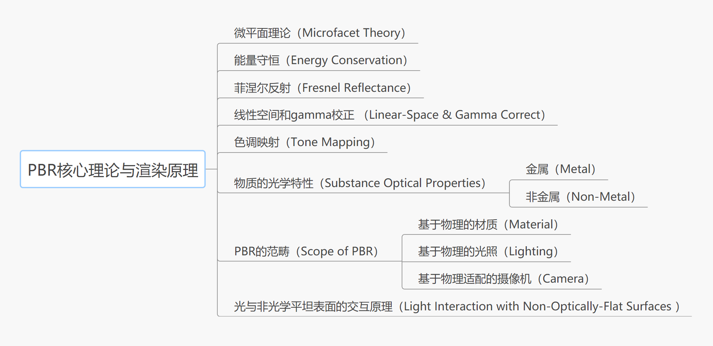

基于物理的渲染（Physically Based
Rendering，PBR）是指使用基于物理原理和微平面理论建模的着色/光照模型，以及使用从现实中测量的表面参数来准确表示真实世界材质的渲染理念。

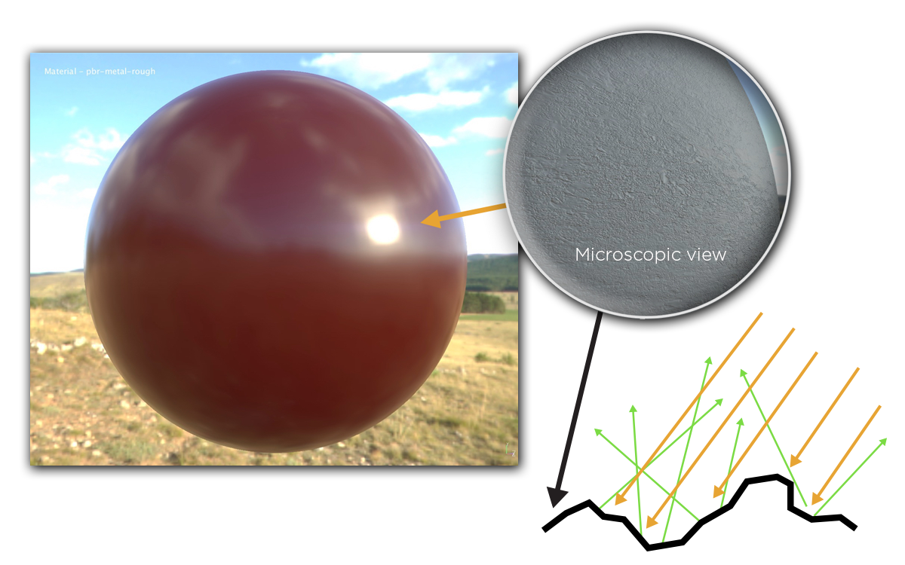

以下是对PBR基础理念的概括：

-   **微平面理论（Microfacet Theory）**。微平面理论是将物体表面建模成做无数微观尺度上有随机朝向的理想镜面反射的小平面（microfacet）的理论。在实际的PBR
    工作流中，这种物体表面的不规则性用粗糙度贴图或者高光度贴图来表示。

-   **能量守恒 （Energy Conservation）**。出射光线的能量永远不能超过入射光线的能量。随着粗糙度的上升镜面反射区域的面积会增加，作为平衡，镜面反射区域的平均亮度则会下降。

-   **菲涅尔反射（Fresnel Reflectance）**。光线以不同角度入射会有不同的反射率。相同的入射角度，不同的物质也会有不同的反射率。万物皆有菲涅尔反射。F0是即0度角入射的菲涅尔反射值。大多数非金属的F0范围是0.02\~0.04，大多数金属的F0范围是0.7\~1.0。

-   **线性空间（Linear Space）**。光照计算必须在线性空间完成，shader 中输入的gamma空间的贴图比如漫反射贴图需要被转成线性空间，在具体操作时需要根据不同引擎和渲染器的不同做不同的操作。而描述物体表面属性的贴图如粗糙度，高光贴图，金属贴图等必须保证是线性空间。

-   **色调映射（Tone Mapping）**。也称色调复制（tone reproduction），是将宽范围的照明级别拟合到屏幕有限色域内的过程。因为基于HDR渲染出来的亮度值会超过显示器能够显示最大亮度，所以需要使用色调映射，将光照结果从HDR转换为显示器能够正常显示的LDR。

-   **物质的光学特性（Substance Optical Properties）** 。现实世界中有不同类型的物质可分为三大类：绝缘体（Insulators），半导体（semi-conductors）和导体（conductors）。在渲染和游戏领域，我们一般只对其中的两个感兴趣：导体（金属）和绝缘体（电解质，非金属）。其中非金属具有单色/灰色镜面反射颜色。而金属具有彩色的镜面反射颜色。即非金属的F0是一个float。而金属的F0是一个float3，如下图。

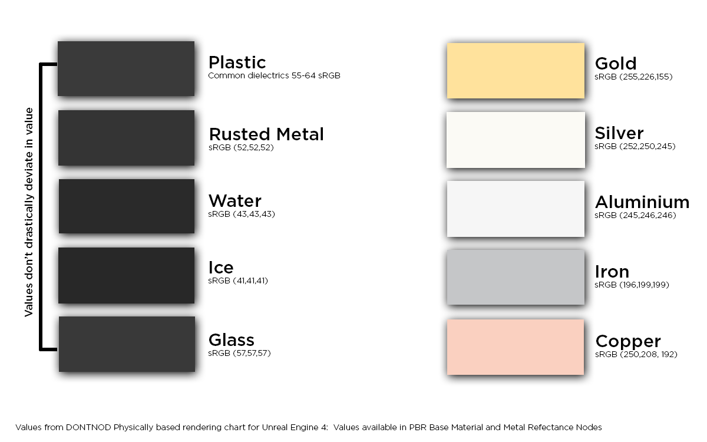

图 金属和非金属材质的F0范围

除了PBR的基础理论，光与非光学平坦表面的交互对理解微平面理论（Microfacet
Theory）至关重要。下面进行一些说明。

## 1.1 光与非光学平坦表面的交互原理

光在与非光学平坦表面（Non-Optically-Flat
Surfaces）的交互时，非光学平坦表面表现得像一个微小的光学平面表面的大集合。表面上的每个点都会以略微不同的方向对入射光反射，而最终的表面外观是许多具有不同表面取向的点的聚合结果。

图：来自非光学平坦表面的可见光反射是来自具有不同方向的许多表面点的反射的总体结果

在微观尺度上，表面越粗糙，反射越模糊，因为表面取向与整个宏观表面取向的偏离更强。

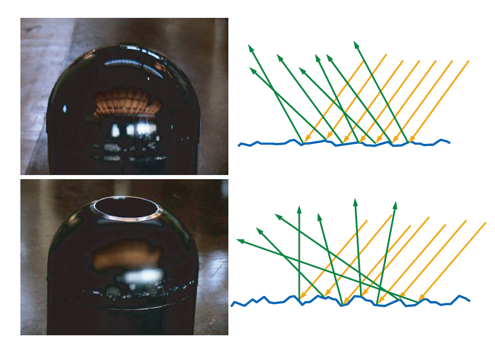

图 图片顶部所示的表面，表面相对光滑;
表面取向仅略有变化，导致反射光方向的微小变化，从而产生更清晰的反射。
图片底部所示的的表面较粗糙;
表面上的不同点具有广泛变化的方向取向，导致反射光方向的高度变化，并因此导致模糊的反射。
注意，两个表面在肉眼可见尺度下看起来都是光滑的，粗糙度差异仅在微观尺度上。

出于着色的目的，我们通常会去用统计方法处理这种微观几何现象，并将表面视为在每个点处在多个方向上反射（和折射）光。

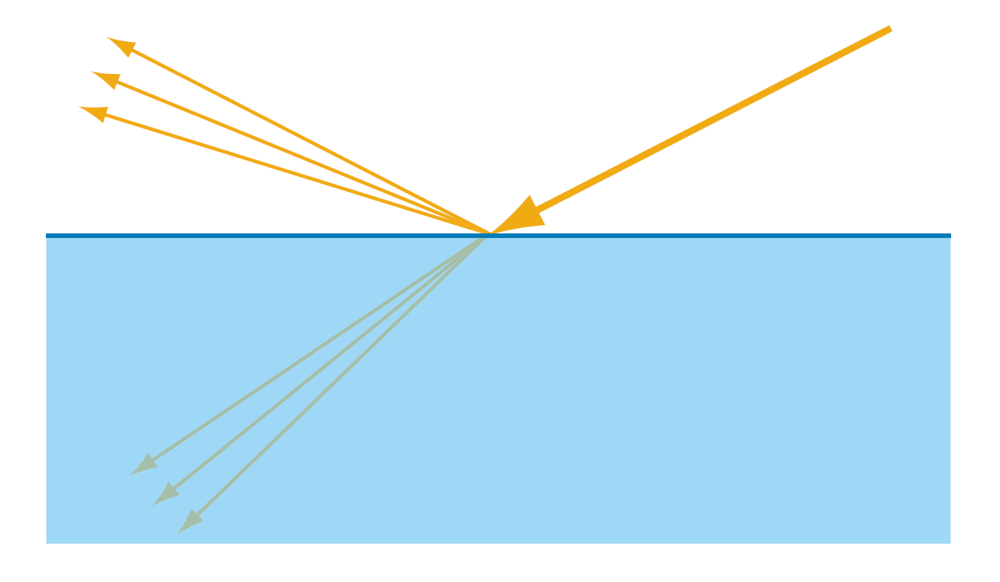

图 从宏观上看，非光学平面可以被视为在多个方向上反射（和折射）光

从表面反射出的光的行为很好理解，那么，从表面折射的光会发生什么变化？
这取决于对象本身的特性：

-   对于金属，折射光会立刻被吸收 - 能量被自由电子立即吸收。

-   对于非金属（也称为电介质或绝缘体），一旦光在其内部折射，就表现为常规的参与介质，表现出吸收和散射两种行为。

图 在金属中，所有折射的光能立即被自由电子吸收;

图
在非金属中，折射的光会进行散射，直到从表面重新射出，而这通常会在经过部分吸收之后

## 1.2 漫反射和次表面散射本质相同

另外，漫反射和次表面散射其实是相同物理现象，本质都是折射光的次表面散射的结果。唯一的区别是相对于观察尺度的散射距离。散射距离相较于像素来说微不足道，次表面散射便可以近似为漫反射。也就是说，光的折射现象，建模为漫反射还是次表面散射，取决于观察的尺度，如下图。

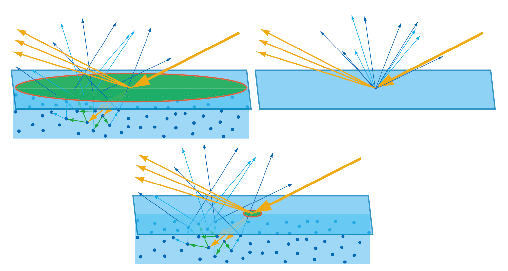

图 在左上角，像素（带有红色边框的绿色圆形）大于光线离开表面之前所经过的距离。
在这种情况下，可以假设出射光从入口点（右上）射出，可以当做漫反射，用局部着色模型处理。
在底部，像素小于散射距离;
如果需要更真实的着色效果，则不能忽略这些距离的存在，需当做次表面散射现象进行处理。

## 1.3 PBR的范畴（Scope of PBR）

寒霜(Frostbite)引擎在SIGGRAPH 2014的分享《Moving Frostbite to
PBR》中提出，基于物理的渲染的范畴，由三部分组成：

-   基于物理的材质（Material）

-   基于物理的光照（Lighting）

-   基于物理适配的摄像机（Camera）

完整的这三者，才是真正完整的基于物理的渲染系统。而很多同学一提到PBR，就说PBR就是镜面反射采用微平面Cook-Torrance模型，其实是不太严谨的。

# 二、渲染方程与BxDF

PBR核心知识体系的第二部分是渲染方程与BxDF。渲染方程作为渲染领域中的重要理论，将BxDF代入渲染方程是求解渲染问题的一般方法。

## 2.1 渲染方程与反射方程

渲染方程(The Rendering
Equation)作为渲染领域中的重要理论，其描述了光能在场景中的流动*，*是渲染中不可感知方面的最抽象的正式表示。根据光学的物理学原理，渲染方程在理论上给出了一个完美的结果，而各种各样的渲染技术，只是这个理想结果的一个近似。

渲染方程的物理基础是能量守恒定律。在一个特定的位置和方向，出射光 Lo 是自发光 Le
与反射光线之和，反射光线本身是各个方向的入射光 Li 之和乘以表面反射率及入射角。

这个方程经过交叉点将出射光线与入射光线联系在一起，它代表了场景中全部的'光线传输。所有更加完善的算法都可以看作是这个方程的特殊形式的解。

某一点p的渲染方程，可以表示为：

其中：

-   Lo是p点的出射光亮度。

-   Le是p点发出的光亮度。

-   fr是p点入射方向到出射方向光的反射比例，即BxDF，一般为BRDF。

-   Li是p点入射光亮度。

- 是入射角带来的入射光衰减

- 是入射方向半球的积分（可以理解为无穷小的累加和）。

而在实时渲染中，我们常用的反射方程(The Reflectance Equation)，则是渲染方程的简化的版本，或者说是一个特例：

其中：

-   Lo是p点的出射光亮度。

-   fr是p点入射方向到出射方向光的反射比例，即BxDF，一般为BRDF。

-   Li是p点入射光亮度。

是入射角带来的入射光衰减

是入射方向半球的积分（可以理解为无穷小的累加和）。

## 2.2 BxDF

BxDF一般而言是对BRDF、BTDF、BSDF、BSSRDF等几种双向分布函数的一个统一的表示。

其中，BSDF可以看做BRDF和BTDF更一般的形式，而且BSDF = BRDF + BTDF。

而BSSRDF和BRDF的不同之处在于，BSSRDF可以指定不同的光线入射位置和出射位置。

在上述这些BxDF中，BRDF最为简单，也最为常用。因为游戏和电影中的大多数物体都是不透明的，用BRDF就完全足够。而BSDF、BTDF、BSSRDF往往更多用于半透明材质和次表面散射材质。

图 BSDF：BRDF + BTDF

我们时常讨论的PBR中的BxDF，一般都为BRDF，对于进阶的一些材质的渲染，才会讨论BSDF等其他三种BxDF。

另外，BxDF即上文所示渲染方程以及反射方程中的fr项。

2.3 BRDF的分类
--------------

图 BRDF的分类，来自[Montes R, Ureña C. An overview of BRDF models[J]. 2012]

 

# 三、迪士尼原则的BxDF（Disney Principled BxDF）

PBR核心知识体系的第三部分是迪士尼原则的BxDF。迪士尼动画工作室在SIGGRAPH
2012上注明的talk上提出了著名的talk《Physically-based shading at
Disney》中提出了迪士尼原则的BRDF（Disney Principled
BRDF），奠定了后续游戏行业和电影行业PBR的方向和标准。了解Disney Principled
BxDF，是深入理解PBR的重要一环。

基于物理的渲染，其实早在20世纪就已经在图形学业界有了一些讨论，2010年在SIGGRAPH上就已经有公开讨论的Course
《SIGGRAPH 2010 Course: Physically-Based Shading Models in Film and Game
Production》，而直到2012\~2013年，才正式进入大众的视野，渐渐被电影和游戏业界广泛使用。

迪士尼动画工作室则是这次PBR革命的重要推动者。迪士尼的Brent Burley于SIGGRAPH
2012上进行了著名的talk《Physically-based shading at
Disney》，提出了迪士尼原则的BRDF（Disney Principled BRDF），
由于其高度的通用性，将材质复杂的物理属性，用非常直观的少量变量表达了出来（如金属度metallic和粗糙度roughness），在电影业界和游戏业界引起了不小的轰动。从此，基于物理的渲染正式进入大众的视野。

图 SIGGRAPH 2012《Physically-based shading at Disney》

在2012年受到Disney的启发后，以下是主流游戏引擎从传统渲染转移到基于物理的渲染时间节点：

-   【SIGGRAPH 2013】 UE4 ：《Real shading in unreal engine 4》

-   【SIGGRAPH 2014】 Frostbite（寒霜）： 《Moving Frostbite to PBR》

-   【GDC 2014】 Unity：Physically Based Shading in Unity

## 3.1 迪士尼原则的BRDF（Disney Principled BRDF）

### 3.1.1 Disney Principled BRDF核心理念

在2012年迪士尼原则的BRDF被提出之前，基于物理的渲染都需要大量复杂而不直观的参数，此时PBR的优势，并没有那么明显。

在2012年迪士尼提出，他们的**着色模型是艺术导向（Art Directable）的，而不一定要是完全物理正确（physically correct**的，并且对微平面BRDF的各项都进行了严谨的调查，并提出了清晰明确而简单的解决方案。

迪士尼的理念是开发一种“原则性”的易用模型，而不是严格的物理模型。正因为这种艺术导向的易用性，能让美术同学用非常直观的少量参数，以及非常标准化的工作流，就能快速实现涉及大量不同材质的真实感的渲染工作。而这对于传统的着色模型来说，是不可能完成的任务。

迪士尼原则的BRDF（Disney Principled BRDF）核心理念如下：

1.  应使用直观的参数，而不是物理类的晦涩参数。

2.  参数应尽可能少。

3.  参数在其合理范围内应该为0到1。

4.  允许参数在有意义时超出正常的合理范围。

5.  所有参数组合应尽可能健壮和合理。

以上五条原则，很好地保证了迪士尼原则的BRDF的易用性。

### 3.1.2 Disney Principled BRDF参数

以上述理念为基础，迪士尼动画工作室对每个参数的添加进行了把关，最终得到了一个颜色参数（baseColor）和下面描述的十个标量参数：

-   **baseColor（基础色）**：表面颜色，通常由纹理贴图提供。

-   **subsurface（次表面）**：使用次表面近似控制漫反射形状。

-   **metallic（金属度）**：金属（0 =电介质，1
    =金属）。这是两种不同模型之间的线性混合。金属模型没有漫反射成分，并且还具有等于基础色的着色入射镜面反射。

-   **specular（镜面反射强度）**：入射镜面反射量。用于取代折射率。

-   **specularTint（镜面反射颜色）**：对美术控制的让步，用于对基础色（base
    color）的入射镜面反射进行颜色控制。掠射镜面反射仍然是非彩色的。

-   **roughness（粗糙度）**：表面粗糙度，控制漫反射和镜面反射。

-   **anisotropic（各向异性强度）**：各向异性程度。用于控制镜面反射高光的纵横比。
    （0 =各向同性，1 =最大各向异性。）

-   **sheen（光泽度）**：一种额外的掠射分量（grazing component），主要用于布料。

-   **sheenTint（光泽颜色）**：对sheen（光泽度）的颜色控制。

-   **clearcoat（清漆强度）**：有特殊用途的第二个镜面波瓣（specular lobe）。

-   **clearcoatGloss（清漆光泽度）**：控制透明涂层光泽度，0 =“缎面（satin）”外观，1
    =“光泽（gloss）”外观。

每个参数的效果的渲染示例如下图所示。

图 Disney Principled BRDF。 每行的参数从0到1变化，其他参数保持不变

## 3.2 迪士尼原则的BSDF（Disney Principled BSDF）

随后的2015年，迪士尼动画工作室在Disney Principled BRDF的基础上进行了修订，提出了Disney Principled BSDF [Extending the Disney BRDF to a BSDF with Integrated Subsurface Scattering, 2015]。

以下是三维软件Blender实现的Disney Principled BSDF的图示：

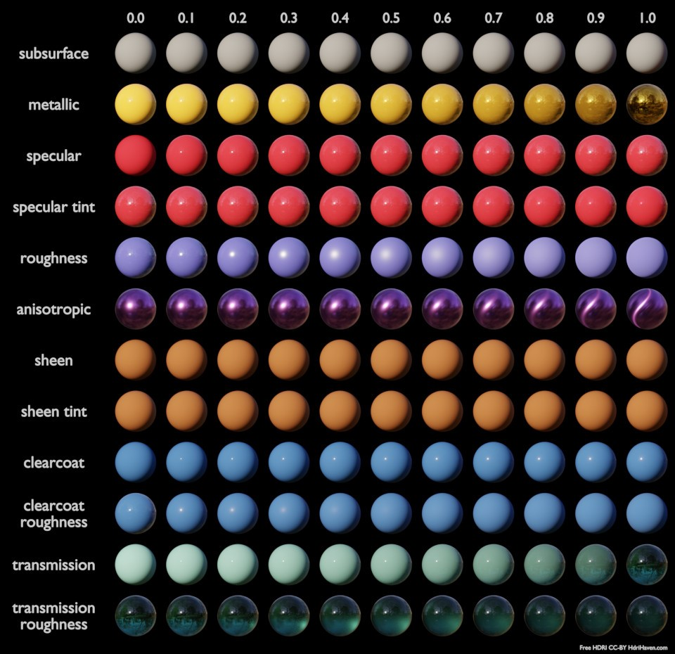
图 Disney Principled BSDF

 

# 四、漫反射BRDF模型（Diffuse BRDF）

为了求解渲染方程，需要分别求解Diffuse BRDF和Specular
BRDF。所以PBR核心知识体系的第四部分是Diffuse BRDF。

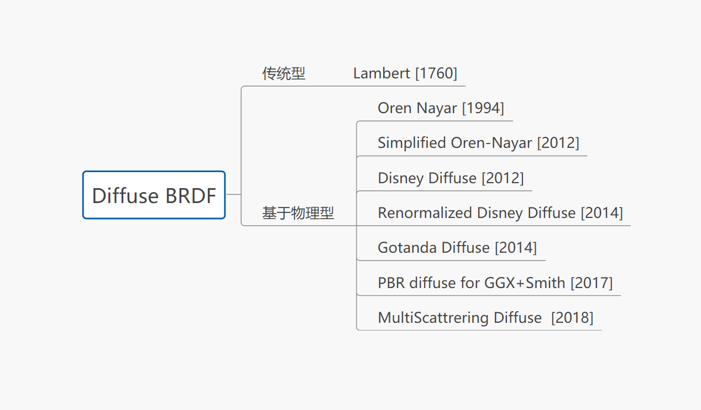

Diffuse BRDF可以分为传统型和基于物理型两大类。其中，传统型主要是众所周知的Lambert。

而基于物理型，从1994年的Oren Nayar开始，这里一直统计到今年（2018年）。

其中较新的有GDC 2017上提出的适用于GGX+Smith的基于物理的漫反射模型（PBR diffuse for GGX+Smith），也包含了最近在SIGGRAPH2018上提出的，来自《使命召唤：二战》的多散射漫反射BRDF（MultiScattrering Diffuse
BRDF）：

-   Oren Nayar[1994]

-   Simplified Oren-Nayar [2012]

-   Disney Diffuse[2012]

-   Renormalized Disney Diffuse[2014]

-   Gotanda Diffuse [2014]

-   PBR diffuse for GGX+Smith [2017]

-   MultiScattrering Diffuse BRDF [2018]

## 五、镜面反射BRDF模型（Specular BRDF）

PBR核心知识体系的第五部分是Specular BRDF。这也是基于物理的渲染领域中最活跃，最主要的部分。

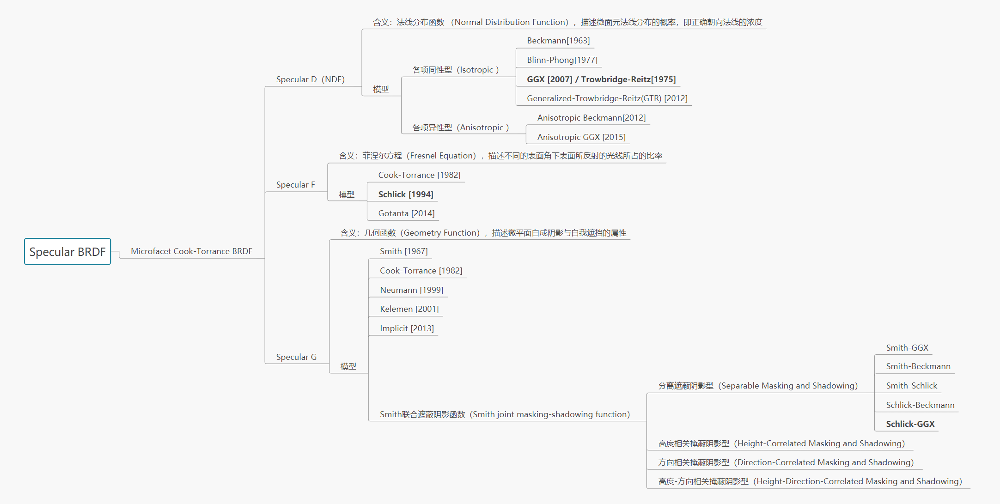

上图加粗部分为目前业界较为主流的模型。

游戏业界目前最主流的基于物理的镜面反射BRDF模型是基于微平面理论（microfacet theory）的Microfacet Cook-Torrance BRDF。

而微平面理论（microfacet theory）源自将微观几何（microgeometry）建模为微平面（microfacets）的集合的思想，一般用于描述来自非光学平坦（non-optically flat）表面的表面反射。

微平面理论的基本假设是微观几何（microgeometry）的存在，微观几何的尺度小于观察尺度（例如着色分辨率），但大于可见光波长的尺度（因此应用几何光学和如衍射一样的波效应等可以忽略）。且微平面理论在2013年和以前时仅用于推导单反射（single-bounce）表面反射的表达式;
而随着领域的深入，最近几年也出现了使用microfacet理论对多次反弹表面反射的一些探讨。

由于假设微观几何尺度明显大于可见光波长，因此可以将每个表面点视为光学平坦的。
如上文所述，光学平坦表面将光线分成两个方向：反射和折射。

每个表面点将来自给定进入方向的光反射到单个出射方向，该方向取决于微观几何法线（microgeometry normal）m的方向。 在计算BRDF项时，指定光方向l和视图方向v。
这意味着所有表面点，只有那些恰好正确朝向可以将l反射到v的那些小平面可能有助于BRDF值（其他方向有正有负，积分之后，相互抵消）。

在下图中，我们可以看到这些“正确朝向”的表面点的表面法线m正好位于l和v之间的中间位置。l和v之间的矢量称为半矢量（half-vector）或半角矢量（half-angle vector）; 我们将其表示为h。

图 仅m = h的表面点的朝向才会将光线l反射到视线v的方向，其他表面点对BRDF没有贡献。

并非所有m = h的表面点都会积极地对反射做出贡献;一些被l方向（阴影shadowing），v方向（掩蔽masking）或两者的其他表面区域阻挡。Microfacet理论假设所有被遮蔽的光（shadowed light）都从镜面反射项中消失;实际上，由于多次表面反射，其中一些最终将是可见的，但这在目前常见的微平面理论中一般并未去考虑，各种类型的光表面相互作用如下图所示。

图 在左侧，我们看到一些表面点从l的方向被遮挡，因此它们被遮挡并且不接收光（因此它们不能反射任何）。在中间，我们看到从视图方向v看不到一些表面点，因此当然不会看到从它们反射的任何光。在这两种情况下，这些表面点对BRDF没有贡献。实际上，虽然阴影区域没有从l接收任何直射光，但它们确实接收（并因此反射）从其他表面区域反射的光（如右图所示）。microfacet理论忽略了这些相互反射。

## 5.1 从物理现象到BRDF

利用这些假设（局部光学平坦表面，没有相互反射），可以很容易推导出一个被称为Microfacet
Cook-Torrance BRDF的一般形式的Specular BRDF项。此Specular BRDF具有以下形式：

其中：

-   **D（h）**：法线分布函数 （Normal Distribution
    Function），描述微面元法线分布的概率，即正确朝向的法线的浓度。即具有正确朝向，能够将来自l的光反射到v的表面点的相对于表面面积的浓度。

-  **F（l，h）**: 菲涅尔方程（Fresnel
    Equation），描述不同的表面角下表面所反射的光线所占的比率。

-   **G（l，v，h）**几何函数（Geometry Function）：描述微平面自成阴影的属性，即m =
    h的未被遮蔽的表面点的百分比。

-   分母  4（n·l）（n·v）是校正因子（correctionfactor），作为微观几何的局部空间和整个宏观表面的局部空间之间变换的微平面量的校正。

关于Cook-Torrance BRDF，需要强调的两点注意事项：

-   对于分母中的点积，仅仅避免负值是不够的 - 也必须避免零值。通常通过在常规的clamp或绝对值操作之后添加非常小的正值来完成。

-   Microfacet Cook-Torrance BRDF是实践中使用最广泛的模型，实际上也是人们可以想到的最简单的微平面模型。它仅对几何光学系统中的单层微表面上的单个散射进行建模，没有考虑多次散射，分层材质，以及衍射。Microfacet模型，实际上还有很长的路要走。

下面对Microfacet Cook-Torrance BRDF中的D、F、G项分别进行简要说明。

## 5.2 Specular D

法线分布函数（Normal Distribution Function, NDF）D的常见模型可以总结如下：

-   Beckmann[1963]

-   Blinn-Phong[1977]

-   GGX [2007] / Trowbridge-Reitz[1975]

-   Generalized-Trowbridge-Reitz(GTR) [2012]

-   Anisotropic Beckmann[2012]

-   Anisotropic GGX [2015]

其中，业界较为主流的法线分布函数是GGX（Trowbridge-Reitz），因为具有更好的高光长尾：

另外，需要强调一点。**Normal Distribution
Function正确的翻译是法线分布函数，而不是正态分布函数。**google翻译等翻译软件会将Normal
Distribution
Function翻译成正态分布函数，而不少中文资料就跟着翻译成了正态分布函数，这是错误的。其实，一些参考文献会使用术语“法线分布(distribution
of normals)”来避免与高斯正态分布(Gaussian normal distribution)混淆。

## 5.3 Specular F

对于菲涅尔（Fresnel）项，业界方一般都采用Schlick的Fresnel近似，因为计算成本低廉，而且精度足够：

菲涅尔项的常见模型可以总结如下：

-   Cook-Torrance [1982]

-   Schlick [1994]

-   Gotanta [2014]

## 5.4 Specular G

几何项G的常见模型可以总结如下：

-   Smith [1967]

-   Cook-Torrance [1982]

-   Neumann [1999]

-   Kelemen [2001]

-   Implicit [2013]

另外，Eric Heitz在[Heitz14]中展示了Smith几何阴影函数是正确且更准确的G项，并将其拓展为Smith联合遮蔽阴影函数（Smith Joint Masking-Shadowing Function），该函数具有四种形式：

-   分离遮蔽阴影型（Separable Masking and Shadowing）

-   高度相关掩蔽阴影型（Height-Correlated Masking and Shadowing）

-   方向相关掩蔽阴影型（Direction-Correlated Masking and Shadowing）

-   高度-方向相关掩蔽阴影型（Height-Direction-Correlated Masking and Shadowing）

目前较为常用的是其中最为简单的形式，分离遮蔽阴影（Separable Masking and Shadowing Function）。

该形式将几何项G分为两个独立的部分：光线方向（light）和视线方向（view），并对两者用相同的分布函数来描述。根据这种思想，结合法线分布函数（NDF）与Smith几何阴影函数，于是有了以下新的Smith几何项：

-   Smith-GGX

-   Smith-Beckmann

-   Smith-Schlick

-   Schlick-Beckmann

-   Schlick-GGX

其中UE4的方案是上面列举中的“Schlick-GGX”，即基于Schlick近似，将k映射为k=a/2,去匹配GGX Smith方程：

# 六、基于物理的环境光照（Physically Based Environment Lighting ）

有了直接光部分，我们也需要环境光。所以PBR核心知识体系的第六部分是基于物理的环境光照，一般大家也直接默认环境光照的技术方案是基于图像的光照（Image Based Lighting, IBL）。这也是真正让基于物理的渲染画质提升的主要贡献者。

漫反射环境光照部分一般采用传统IBL中辉度环境映射（Irradiance Environment Mapping）技术，并不是基于物理的特有方案，这里暂不讨论。

而基于物理的镜面反射（Specular）环境光照，业界中一般会采用基于图像的光照（IBL）的方案。要将基于物理的BRDF模型与基于图像的光照（IBL）一起使用，需要求解光亮度积分（Radiance Integral），而求解光亮度积分通常会使用重要性采样（Importance Sample）。

重要性采样（Importance Sample）即通过现有的一些已知条件（分布函数），想办法集中于被积函数分布可能性较高的区域(重要的区域)进行采样，进而可高效地计算准确的估算结果的的一种策略。

## 6.1 分解求和近似（Split Sum Approximation）

基于重要性采样的思路，将蒙特卡洛积分公式代入渲染方程可得：

上式的直接求解较为复杂，进行完全的实时渲染不太现实。

目前游戏业界的主流做法是，是基于分解求和近似（Split Sum Approximation）的思路，将上式中的拆分为光亮度的均值和环境BRDF两项。即：

完成拆分后，分别对两项进行离线预计算，去匹配离线渲染参考值的渲染结果。

而在实时渲染中，分别计算分解求和近似（Split Sum Approximation）方案中几乎已经预计算好的两项，再进行组合，作为实时的IBL物理环境光照部分的渲染结果。下面分别对两项进行简单概括。

## 6.2 第一项 预过滤环境贴图（Pre-filtered environment map）

第一项为，可以理解为对光亮度求均值。经过**n**= **v**= **r**的假设，仅取决于表面粗糙度（surface roughness）和反射矢量（reflection vector）。这一项，业界的做法比较统一（包括UE4和COD：Black Ops 2等），采用的方案主要借助预过滤环境贴图，用多级模糊的mipmap来存储模糊的环境高光:

也就是说，第一项直接使用cubemap 的mip级别采样输入即可。

## 6.3 第二项 环境BRDF （Environment BRDF）

第二项为，即镜面反射项的半球方向反射率（hemispherical-directionalreflectance），可以理解为环境BRDF （Environment BRDF）。其取决于仰角θ，粗糙度α和菲涅耳项F。 通常使用Schlick近似来近似F，其仅在单个值F0上参数化，从而使Rspec成为三个参数（仰角θ（NdotV），粗糙度α、F0）的函数。

这一项的主要流派有两个，UE4的2D LUT，以及COD：OP2的解析拟合。

### 6.3.1 流派1：2D LUT

UE4在[]中提出，第二个求和项 ，使用Schlick近似后， F0可以从积分中分出来：

上式留下了两个输入（Roughness 和 cos θv）和两个输出（缩放和向F0的偏差（a scale and bias to F0）），即把上述方程看成是F0 * Scale + Offset的形式。
我们预先计算此函数的结果并将其存储在2D查找纹理（LUT，look-up texture）中。

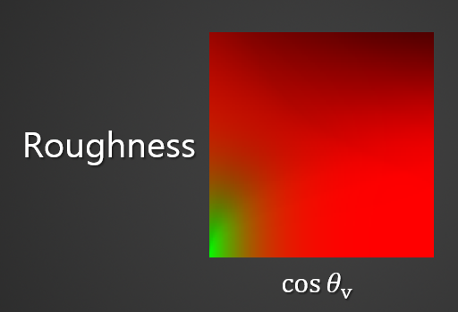

这张红绿色的贴图，输入roughness、cosθ，输出环境BRDF镜面反射的强度。是关于roughness、cosθ与环境BRDF镜面反射强度的固有映射关系。可以离线预计算。

具体的取出方式为：

即UE4是通过把Fresnel公式的F0提出来，组成F0 * Scale +Offset的方式，再将Scale和Offset的索引存到一张2D LUT上。靠roughness和
NdotV进行查找。

### 6.3.2 流派2：解析拟合

COD：Black Ops 2的做法，通过数学工具Mathematica（http://www.wolfram.com/mathematica/） 中的数值积分拟合出曲线，即将UE4离线计算的这张2D
LUT用如下函数进行了拟合：

    float3 EnvironmentBRDF( float g, float NoV, float3 rf0 )
    {
        float4 t = float4( 1/0.96, 0.475, (0.0275 - 0.25 \* 0.04)/0.96, 0.25 );
        t *= float4( g, g, g, g );
        t += float4( 0, 0, (0.015 - 0.75 * 0.04)/0.96, 0.75 );
        float a0 = t.x * min( t.y, exp2( -9.28 * NoV ) ) + t.z; float a1 = t.w;
        return saturate( a0 + rf0 * ( a1 - a0 ) );
    }

需要注意的是，上面的方程是基于Blinn-Phong分布的结果，https://knarkowicz.wordpress.com/2014/12/27/analytical-dfg-term-for-ibl/ 一文中提出了基于GGX分布的EnvironmentBRDF解析版本：

    float3 EnvDFGLazarov( float3 specularColor, float gloss, float ndotv )
    {
        float4 p0 = float4( 0.5745, 1.548, -0.02397, 1.301 );
        float4 p1 = float4( 0.5753, -0.2511, -0.02066, 0.4755 );
        float4 t = gloss * p0 + p1;
        float bias = saturate( t.x * min( t.y, exp2( -7.672 * ndotv ) ) + t.z );
        float delta = saturate( t.w );
        float scale = delta - bias;
        bias *= saturate( 50.0 * specularColor.y );
        return specularColor * scale + bias;
    }

上式中的specularColor即F0。

EnvironmentBRDF函数的输入参数分别为光泽度gloss，NdotV，F0。和UE4的做法有异曲同工之妙，但COD：Black Ops 2的做法不需要额外的贴图采样，这在进行移动端优化时，是不错的选择。

### 6.3.3 其他流派

Gotanda在SIGGRAPH 2010提出使用3D LUT[Practical Implementation of Physically-Based Shading Models at tri-Ace,2010]来存放环境BRDF，之后Drobot将其优化为2D LUT[Lighting Killzone:Shadow Fall , 2013]。

 

# 七、离线渲染相关（Offline Rendering Related）

虽然我们目前主要关注的是实时渲染（实时光栅图形学相关，暂时不关注实时光线追踪）领域，但很多时候，实时渲染也需要涉及到预计算，尤其是IBL相关的预计算，所以或多或少会用到离线渲染相关的知识。所以PBR核心知识体系的第七部分是离线渲染相关的主题。

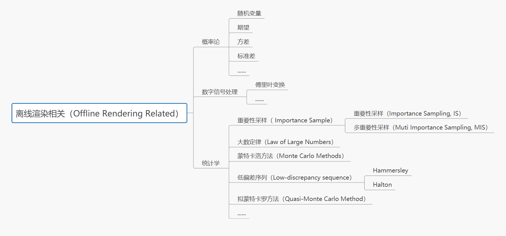

以下是与实时渲染结合相对紧密的离线渲染相关的核心主题以及概括总结（主要是统计学与概率相关）：

-   **重要性采样（ Importance Sample）**：蒙特卡洛积分的一种采样策略。思路是基于分布函数，尽量对被积函数分布可能性较高的区域进行采样。

-   **多重要性采样（Muti Importance Sampling, MIS）** ：估算某一积分时，基于多个分布函数获取采样，并期望至少某一分布与被积函数形状适配。即根据各种技术对采样进行加权计算，进而消除源自被积函数值与采样密度不匹配造成的较大反差。

-   **大数定律（Law of Large Numbers）** ：在试验不变的条件下，重复试验多次，随机事件的频率近似于它的概率。即偶然中包含着某种必然。

-   **蒙特卡洛方法（Monte Carlo Methods）** ：一种以概率统计理论为指导的数值计算方法。是指使用随机数（或更常见的伪随机数）来解决很多计算问题的方法。

-   **低偏差序列（Low-discrepancy sequence）** ：一种确定生成的超均匀分布列，也称为拟随机列、次随机列，常见低偏差序列有Hammersley，Halton等。

-   **拟蒙特卡罗方法（Quasi-Monte Carlo Method）** ：使用低差异列来进行数值积分和研究其它一些数值问题的方法。

-   等

与实时渲染结合相对紧密的离线渲染相关的内容，后续文章会以专题的形式详细探讨。

 

# 八、进阶渲染主题（Advanced Rendering Topics）

前面的核心PBR主题都讨论完成后，会有更多进阶的内容浮出水面，他们共同组成了PBR核心知识体系的第八部分。

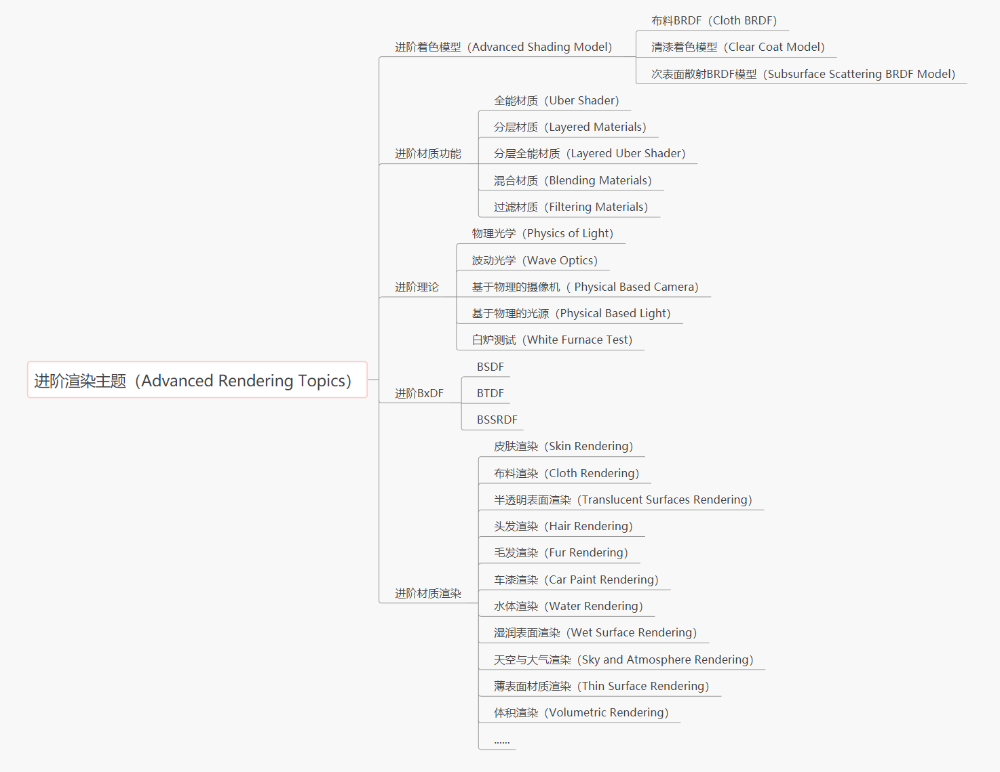

以下是一个列举：

-   进阶着色模型（Advanced Shading Model）

    -   布料BRDF（Cloth BRDF）

    -   清漆着色模型（Clear Coat Model）

    -   次表面散射BRDF模型（Subsurface Scattering BRDF Model）

-   进阶材质功能

    -   全能材质（Uber Shader）

    -   分层材质（Layered Materials）

    -   分层全能材质（Layered Uber Shader）

    -   混合材质（Blending Materials）

    -   过滤材质（Filtering Materials）

-   进阶理论

    -   物理光学（Physics of Light）

    -   波动光学（Wave Optics）

    -   微观几何（Microgeometry）

    -   基于物理的摄像机（ Physical Based Camera）

    -   基于物理的光源（Physical Based Light）

    -   白炉测试（White Furnace Test）

-   进阶BxDF

    -   BSDF

    -   BTDF

    -   BSSRDF

-   进阶材质渲染

    -   皮肤渲染（Skin Rendering）

    -   布料渲染（Cloth Rendering）

    -   半透明表面渲染（Translucent Surfaces Rendering）

    -   头发渲染（Hair Rendering）

    -   毛发渲染（Fur Rendering）

    -   车漆渲染（Car Paint Rendering）

    -   水体渲染（Water Rendering）

    -   湿润表面渲染（Wet Surface Rendering）

    -   天空与大气渲染（Sky and Atmosphere Rendering）

    -   薄表面材质渲染（Thin Surface Rendering）

    -   体积渲染（Volumetric Rendering）

    -   等

以上这些内容，作为进阶的主题，随便选取其中的一个展开来讨论，几乎都会有不小的篇幅。目前的计划是，是在前七章基础PBR内容讨论完成后，再在这些主题中选取新的内容，进行更深入的讨论。

# 结语

OK，这篇文作为这个系列对PBR知识体系的一个概览，相当于开了一个头，给全新的篇章描绘出了大致的轮廓。

后续的文章，会对PBR知识体系的各个章节，进行更系统深入的论述。

敬请期待。

# Reference

[1] Burley B, Studios W D A. Physically-based shading at disney[C]//ACM
SIGGRAPH. 2012

[2] Montes R, Ureña C. An overview of BRDF models[J]. 2012.

[3] <https://graphicrants.blogspot.com/2013/08/specular-brdf-reference.html>

[4] Karis B, Games E. Real shading in unreal engine 4[J]. Proc. Physically Based
Shading Theory Practice, 2013

[5] Lazarov D. Getting more physical in call of duty: Black ops ii[J]. SIGGRAPH
Course Notes: Physically Based Shading in Theory and Practice, 2013.

[6] Hoffman N. Background: physics and math of shading[J]. Physically Based
Shading in Theory and Practice, 2013

[7] Neubelt D, Pettineo M, Studios R A D. Crafting a Next-Gen Material Pipeline
for The Order: 1886[J]. Physically Based Shading in Theory and Practice,
SIGGRAPH, 2013.

[8] Pharr M, Jakob W, Humphreys G. Physically based rendering: From theory to
implementation[M]. Morgan Kaufmann, 2016.

[9] Akenine-Moller T, Haines E, Hoffman N. Real-time rendering[M]. AK Peters/CRC
Press, 2018.

[10] Heitz E. Understanding the masking-shadowing function in microfacet-based
BRDFs[J]. Journal of Computer Graphics Techniques, 2014, 3(2): 32-91.

[11] Gotanda Y. Designing Reflectance Models for New Consoles[J], 2014

[12] Lagarde S, De Rousiers C. Moving Frostbite to PBR[J]. Proc. Physically
Based Shading Theory Practice, 2014.

[13] Langlands A. Physically based shader design in arnold[J]. Physically Based
Shading in Theory and Practice-SIGGRAPH Courses, 2014.

[14] Burley B. Extending the Disney BRDF to a BSDF with integrated subsurface
scattering[J]. Physically Based Shading in Theory and Practice'SIGGRAPH Course,
2015.

[15] Drobot M. Practical Multilayered Materials in Call of Duty: Infinite
Warfare[J]. Physically Based Shading Theory Practice-SIGGRAPH Courses, 2017.

[16] Oren M, Nayar S K. Generalization of Lambert's reflectance model[C],1994

[17] Gotanda Y. Beyond a simple physically based Blinn-Phong model in
real-time[M]//SIGGRAPH 2012 course. 2012.

[18] Gotanda Y. Practical Implementation of Physically-Based Shading Models at
tri-Ace[J]. part of “Physically Based Shading Models in Film and Game
Production,” SIGGRAPH, 2010.

[19] Hammon Jr E. PBR Diffuse Lighting for GGX+ Smith Microsurfaces[J]. 2017.

[20] <https://knarkowicz.wordpress.com/2014/12/27/analytical-dfg-term-for-ibl/>

[21] Drobot M. Lighting of Killzone: Shadow Fall[J]. Digital Dragons European
Games Festival, 2013.

[22] Material Advances in Call of Duty: WWII, Activision Community , Advances in
Real-Time Rendering , SIGGRAPH 2018

[23] 题图来自《Assassin's Creed Odyssey》

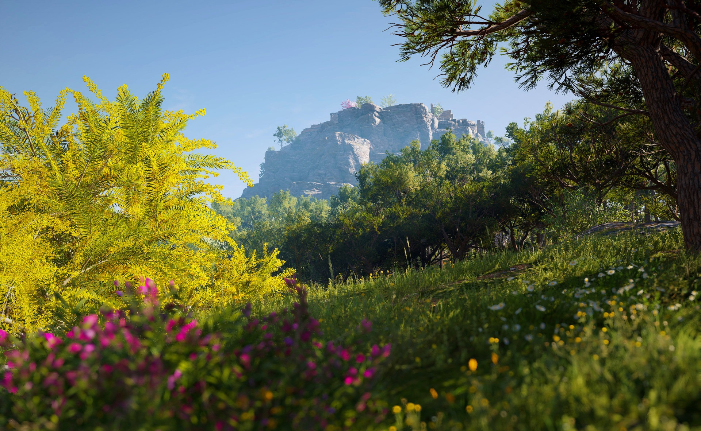
